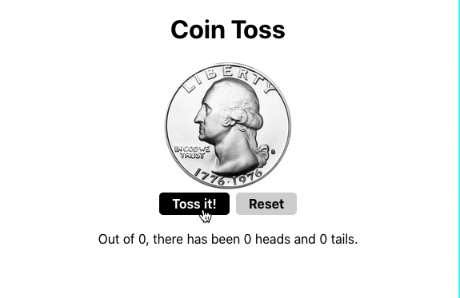

# How to run on repl.it

1. Press run button on the top middle ( issa big green tab xD )
2. On console ` npm start ` ( it'll run ez )

## Project

I created the coin flipper counter with an additional CSS animation to add some personal flare. When pressing the "Toss It!" button a function is called to change the state of the app based on the random outcome of the coin selected. Every flip is counted as well as the side of the coin that is called. I also added a reset button to this app. 

This project uses React, JSX and CSS. It is built with only two React components.

:thumbsup: 

